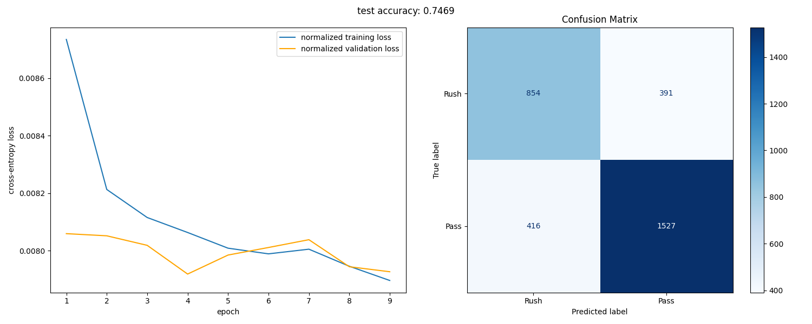

# NFL Play Prediction: Pass vs Rush Classification

Predicting offensive play types (rush vs pass) using neural networks trained on NFL Big Data Bowl tracking data.

## Overview

Football is a game of inches and inches make the champion. In a game where every inch counts, being able to quickly process the available information dictates a team’s success. While NFL offenses are doing their best to disguise their play calls, pre-snap information such as formations and personnel packages can still give away what type of play is going to be run.
These data, combined with contextual game state information serve as cues to reveal offensive tendencies. This project examines how these cues can be used to predict an offense’s upcoming play call.

I developed a neural network classifier to predict whether an NFL offense will execute a pass or rush play based on pre-snap player positioning and game context features. The model achieves **74.69% accuracy** on held-out test data from the 2022  NFL season.

## Results


| Metric        | Pass  | Rush  | Overall |
|---------------|-------|-------|---------|
| **Precision** | 79.6% | 67.2% | 74.8%   |
| **Recall**    | 78.6% | 68.6% | 74.7%   |
| **F1-Score**  | 79.1% | 67.9% | 74.7%   |

**Test Data:** 3,188 plays from 2022 NFL season (61% pass, 39% rush)

**Observation:** The model performs better on pass plays, likely due to class imbalance or potentially clearer indicators for passing compared to rushing plays.

## Technical Details

### Model Architecture
- **Type:** Feed-forward neural network
- **Input:** Engineered features from player positions, game context, offensive formation and personnel
- **Hidden Layers:** 2 layers with ReLU activation and dropout to counteract overfitting
- **Output:** Binary classification (pass vs rush)
- **Loss Function:** Binary Cross-Entropy
- **Optimizer:** Adam

### Feature Engineering
Key features derived from data:
- Player spatial distributions (offensive formations)
- Offensive personnel
- Game situation (score differential, time remaining)

### Known Limitations
**Overfitting Problem:** As visible in the learning curves above, the model exhibits strong overfitting behavior:
- Training loss continues decreasing while validation loss plateaus as early as epoch 4
- Suggests the model may be memorizing training patterns rather than learning generalizable features


**Contributions welcome!** If you have ideas for improving generalization, feel free to experiment and share insights.

## Project Structure
```
nfl-play-prediction/
├── README.md           # Project documentation
├── requirements.txt    # Python dependencies
├── data/              # Dataset location (see data/README.md for access)
├── figures/           # Visualizations and evaluation plots
├── models/            # Trained model checkpoint
├── paper/             # Research paper (PDF)
└── src/               # Source code (preprocessing, training, evaluation)
```

## Getting Started

Follow these steps to set up and run the project locally.

### Prerequisites
```bash
pip install -r requirements.txt
```

### Option 1: Use Pre-trained Model

The repository includes a pre-trained model ready for inspection:
```python
import torch

checkpoint = torch.load("models/model_and_results.pt")

# View training metrics
print(f"Test Accuracy: {checkpoint['accuracy']:.4f}")
print(f"Epochs trained: {checkpoint['epochs']}")

# Access predictions for custom analysis
y_true = checkpoint['y_true']
y_pred = checkpoint['y_pred']
```

**The checkpoint contains:**
- Model weights (`model_state_dict`)
- Test set accuracy and predictions
- Training/validation loss history (to analyze overfitting)


### Option 2: Train From Scratch

**Get Data:** See [`data/README.md`](data/README.md) for dataset access (no longer publicly available on Kaggle).

**Train Model:**
```bash
python src/test.py
```

This will preprocess data, train the model, and generate evaluation metrics.

**Generate Visualizations:**
```bash
python src/visualizations.py
```

## 📝 Research Paper & Future Work

Full  details are available in the [research paper](paper/Predicting_NFL_Play_Types.pdf). The paper includes some light EDA and explains the rationale behind the chosen features, so it might be worth checking out if you're not too familiar with american football.

### Extending This Work

Several promising directions for improvement:

1. **Addressing Overfitting:**
    - Implement more state-of-the-art regularization techniques
    - Increase dataset size or apply data augmentation
    - Try ensemble methods


2. **Advanced Architectures:**
    - LSTM/GRU networks to capture sequential pre-snap motion
    - Attention mechanisms to identify key players
    - Graph neural networks to model player relationships

Here you could make use of the detailed player tracking data (**tracking_week_*.csv**).

3. **Feature Improvements:**
    - Incorporate player tracking motion (velocity, acceleration)
    - Include historical play-calling tendencies
    - Add weather conditions and individual performance metrics for player ins skill positions (QB, RB, WR)


---

*For questions or collaboration: [liam.barakat@gmail.com](mailto:liam.barakat@gmail.com)*
